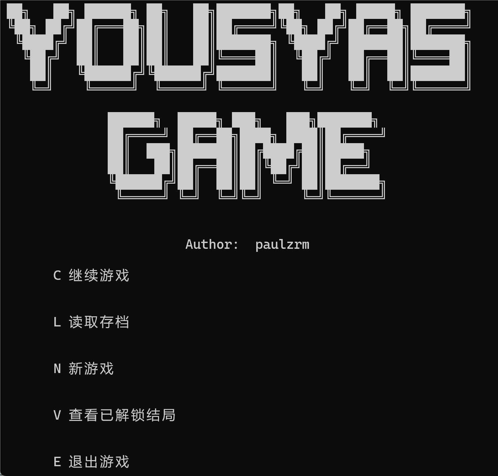
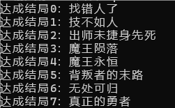

# Yousya's Game（勇者的游戏）

Yousya's Game 是一款由 Ruimin Zhang（paulzrm）于 2026 年 1 月至 2 月独立制作的 Windows 控制台剧情 RPG。游戏以文字叙事、彩色字符地图、即时追踪战斗与多结局选择为核心。



> 仓库中的剧情说明会涉及核心反转。第一次游玩建议直接启动游戏。

## 游戏内容

- 完整操作教程与失败结局
- 赤烬之地、霜骸冰原、雷鸣裂谷与影渊圣所
- 钥匙探索、随机迷宫、动态冰障、雷暴地形与限时生存
- 敌人 120° 视野、追踪、攻击准备与武器碰撞
- 障碍、传送信标、金币与收起武器能力
- 最终阵营选择、两条终局战斗路线和 8 个结局

## 操作

| 按键 | 功能 |
| --- | --- |
| `W A S D` | 移动 |
| 方向键 | 改变武器方向并攻击 |
| `C` | 在身后放置临时障碍，消耗 3 金币 |
| `F` | 设置或返回信标，消耗 5 金币 |
| `V` | 收起或重新拿出武器；达成指定结局后解锁 |

## 章节

1. 教程：移动、战斗、敌人视野、障碍与信标
2. 赤烬之地：收集 4 把钥匙，在炎核圣殿完成生存试炼
3. 霜骸冰原：探索随机冰雪迷宫，在动态冰障中完成试炼
4. 雷鸣裂谷：面对高速敌人与随机雷暴
5. 影渊圣所：揭开世界真相并作出最终选择

## 构建

项目依赖 Windows API，推荐使用 MinGW-w64：

```powershell
g++ -std=gnu++17 -O2 -o yousyas-game.exe main.cpp
```

或使用 CMake：

```powershell
cmake -S . -B build
cmake --build build --config Release
```

源码保留了原作时期的中文编码和控制台输出方式。程序会配置 Windows 控制台以显示彩色字符。

## 网页版

可直接游玩的网页版位于：

https://paulzrm.github.io/games/yousyas-game/

网页版基于完整原作重新实现，并加入独立时间流速、暂停、加密存档导入导出、可视化视野与改进的敌人寻路。

## 结局



游戏包含 8 个可收集结局。结局会记录在存档中，其中部分结局会影响后续周目的能力。

## 仓库说明

仓库保留源码、截图、结局图与压缩后的宣传视频；旧版可执行文件、开发工具包、临时存档、压缩包和原始无损录像不纳入版本控制。
